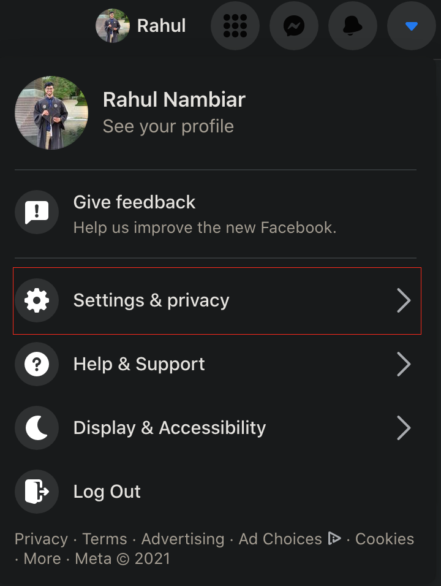
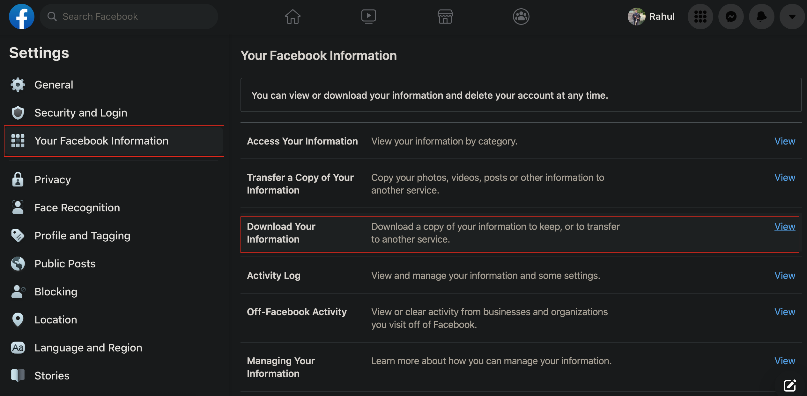
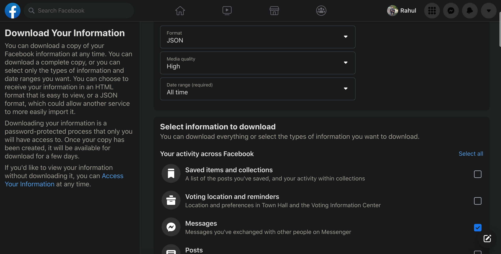
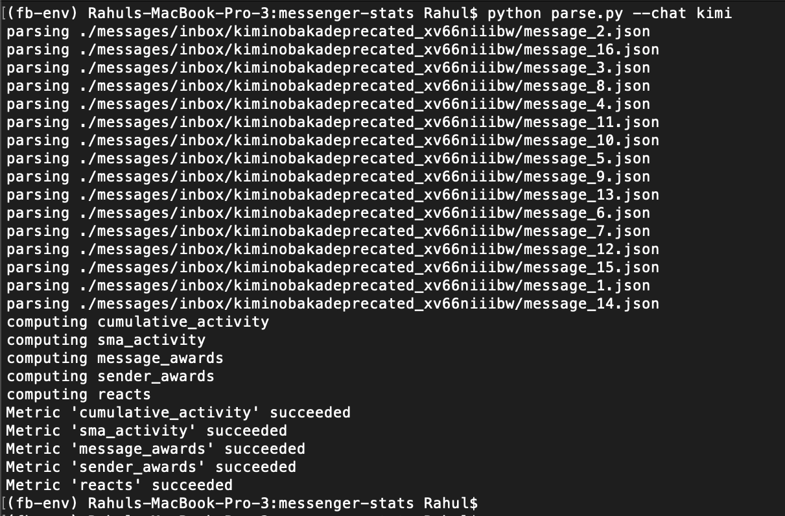

# messenger-stats
Generates various stats about your messenger group chats.

## Metrics
Currently supported metrics:
Metric Name|Display Type|Description
---|---|---
cumulative_activity|Line Graph|Cumulative sum of messeges sent over time per person
sma_activity|Line Graph|Moving average of messages sent per day. Rolling window defaults to 40 days and can be specified with `--sma-window` flag
message_awards|Table|Currenty generates<ul><li>most common messages</li><li>most reacted messagess</li></ul>
sender_awards|Table|Currently generates<ul><li>chatters with most messages in a day</li><li>chatters that are most often mentioned</li><li>chatters that message a certain word most often. This word can be specified with the `--filter-word` flag</li></ul>
reacts|Heatmap and Table|Currently generates<ul><li>heatmap of how often chatters react to each other</li><li>heatmap of what % of a sender's messages are reacted by each of the chatters</li><li>top chatters by reactions received</li><li>top chatters by most reactions received per message sent</li><li>top chatters by most reactions sent</li></ul>

## How to use
Since messenger data is sensitive, this program will not be run as a service, and instead requires users to download and run locally.

### Get Messenger Data
1. Log into FB, and navigate to settings. Do this by clicking on the top right drop down and selecting `Settings & Privacy` and then `Settings`<br/>

<br/>
2. Once in the settings page, on the left bar, select `Your Facebook Information` and then `Download Your Information`

<br/>
3. Here, for file options, select Format `JSON`. Media quality can be anything and `All time` is recommended for the date range.
<br/><br/>
4. For information to download, deselect all and only select `Messages`. Then click `Request a download` at the bottom of the page.

<br/>
5. Facebook will usually take 1-3 days to service the request, but once completed, the files can be downloaded from the `Available files` option in the `Download Your Information` page.
<br/><br/>
6. There will be multiple zip files available (named like "facebook-xyz.zip"). Unzip these one by one and find the folder `messages` that contains all the message data (chats will be nested in `facebook-xyz/messages/inbox/`). This `messages` folder will be used in the next step.

### Install and Run
#### Download Code and Messages
- Clone this repo locally
- Copy the `messages` folder from the previous section to the root of the repo
#### Get Conda
- [Install](https://docs.conda.io/en/latest/miniconda.html) conda
- Run the miniconda script
    ```
    bash Miniconda3-latest-MacOSX-x86_64.sh
    ```
- After following the steps in the script, restart terminal and you should be able to use conda. Running `conda` in the terminal should generate some output.
#### Environment Setup
- Create conda environment
    ```
    conda create -n fb-env python=3.9
    ```
- Activate environment, install poetry, and install required dependencies
    ```
    conda activate fb-env
    pip install poetry
    poetry install
    ```
#### Run
- Run the following from the root of the repo
    ```
    python parse.py --chat <chat-name>
    ```
- Get more info about command line options with
    ```
    python parse.py -h
    ```
- Since the environment has already been created, the program can be run in the in the future by activating the conda environment
    ```
    conda activate fb-env
    ```
<br/>
If everything runs successfully, the program should output something like the following on the terminal:


### Command Line Options
Flag|Required|Description
---|---|---
--chat|True|Chat name or string that chat name starts with
--metrics|False|Space separated list of metrics to run. If omitted, runs all metrics. Choices are in the `metrics` section above
--filter-top|False|create separate figures for top half of chatters
--filter-bottom|False|create separate figures for bottom half of chatters
--filter-word|False|track how many times a specific word was said by each participant in chat
--sma-window|False|rolling window of days for the sma_window metric. Defaults to 40 days